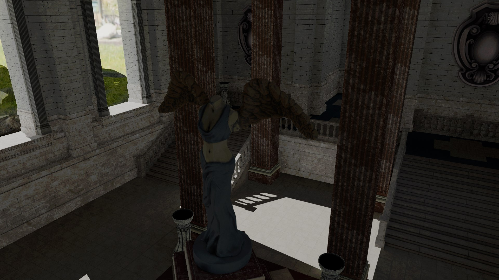

<h1>RTCP - RayTracing Project</h1>

Project is being created as part of B.Sc. thesis. Original is not created in English, therefore below README file serves as summary for broader audience.

<h2>1. RTAO</h2>
<h3>1.1. History</h3>
Ambient occlusion is Global Illumination approximation. It is a technique used for shadowing areas which aren't directly in a shadow of other object. Most likely, it occurs in small spaces like creases or holes which are self-occluded. This technique increases realism of generated image. Real world object even small objects has AO. Even if it is not visible in everyday life, without this effect, image is looking uncanny.

Most impact on current state of AO had Crytek by creating SSAO (Screen-space Ambient Occlusion) in 2007 [1]. Original work wasn't very detailed. However, after SSAO, many works followed creating AO in screenspace e.g. HBAO [2].

There are also other technique which doesn't use screenspace - for example VXAO [3]. You can find more detailed comparison in here [4].

<h3>1.2. Motivation</h3>
RTAO is superior to SSAO because it doesn't rely only on screenspace information. It works with actual geometry which allows to correctly aproximate darkenings in creases and holes in objects. RTAO is finding occlusion by casting rays to actual geometry and it works fine even for small objects. However for SSAO, some radius has to be chosen. Too small radius might cause large objects to fail to render correctly. Too big will ignore small ones.

<h3>1.3 Implementation</h3>
Implemention non-interactive RTAO can be done in few steps:
<ol>
  <li>Calculate world-space coordinates from NDC
  <li>Find random direction in the hemipshere around normal
  <li>Cast ray
  <li>Depending on distance from origin, AO value is calculated. The closer hit is, the darker surface will be. It works that way because if point is surrounded by geometry it means that it'll get less light from environment
</ol>

Full implementation can be find in RT_AO.hlsl file.

<h4>Diffuse pathtracing - 5000 frames, path length - 8</h4>

<h4>Diffuse + specular pathtracing - 5000 frames, path length - 8</h4>

Above images were generated by using techniques listed below:
<ul>
  <li>Correlated Multi-Jittered Sampling - https://graphics.pixar.com/library/MultiJitteredSampling/paper.pdf
  <li>Importance sampling around visible normals - https://schuttejoe.github.io/post/ggximportancesamplingpart2/
  <li>ACES filmic tone mapping curve - https://knarkowicz.wordpress.com/2016/01/06/aces-filmic-tone-mapping-curve/
</ul>

<h4>Other important sources:</h4>
<ul>
  <li>http://cwyman.org/code/dxrTutors/dxr_tutors.md.html - naive RTAO implementation and basic RTGI algorithm
  <li>http://www.realtimerendering.com/raytracinggems/ - gems book on "Open access" license
  <li>https://microsoft.github.io/DirectX-Specs/d3d/Raytracing.html - microsoft documentation of DXR
  <li>https://www.willusher.io/graphics/2019/11/20/the-sbt-three-ways - RT shaders padding explained
  <li>https://github.com/microsoft/DirectX-Graphics-Samples - msdn samples for DirectX12
  <li>https://blog.selfshadow.com/publications/turquin/ms_comp_final.pdf - multiple scattering compensation
</ul>

[1] Martin Mittring 2007 - Finding next gen: CryEngine 2 - https://www.semanticscholar.org/paper/Finding-next-gen%3A-CryEngine-2-Mittring/fe2cf22b09709ef2a27768dc2b7693c07c02c69d 

[2] Louis Bavoil et al 2008 - Image-space horizon-based ambient occlusion - https://www.researchgate.net/publication/215506032_Image-space_horizon-based_ambient_occlusion

[3] https://developer.nvidia.com/vxao-voxel-ambient-occlusion 

[4] Pooria Ghavamian 2019 - Real-time Raytracing and Screen-space Ambient Occlusion http://www.diva-portal.org/smash/record.jsf?pid=diva2%3A1337203&dswid=3596 
