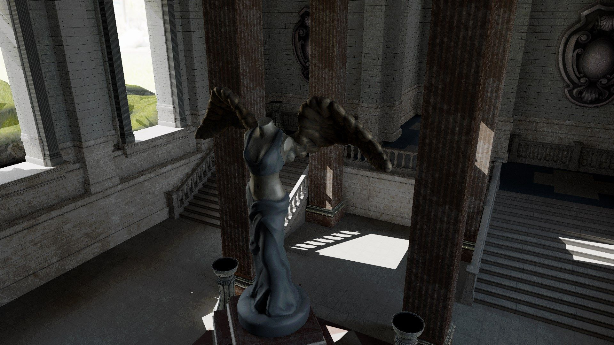
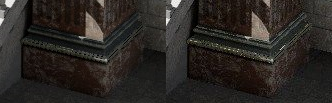

<h1>RTCP - RayTracing Project</h1>

Project is being created as part of B.Sc. thesis. Original is not created in English, therefore below README file serves as summary for broader audience.

<h2>1. RTAO</h2>
RTAO is superior to SSAO because it doesn't rely only on screenspace information. It works with actual geometry which allows to correctly aproximate darkenings in creases and holes in objects. RTAO is finding occlusion by casting rays to actual geometry and it works fine even for small objects. However for SSAO, some radius has to be chosen. Too small radius might cause large objects to fail to render correctly. Too big will ignore small ones.

Implemention non-interactive RTAO can be done in few steps:
<ol>
  <li>Calculate world-space coordinates from NDC
  <li>Find random direction in the hemipshere around normal
  <li>Cast ray
  <li>Depending on distance from origin, AO value is calculated. The closer hit is, the darker surface will be. It works that way because if point is surrounded by geometry it means that it'll get less light from environment
</ol>

Full implementation can be find in RT_AO.hlsl file.

<h2>2. Path Tracing - GGX Visible Normals</h2>
Joe Schutte's blog - https://schuttejoe.github.io/post/ggximportancesamplingpart1/ - based on Heitz work, is providing discussion how to create PDF according to GGX NDF. NDF is most important when determining BRDF lobe shape. Therefore, we want to sample according to NDF. However there are some problems with this technique which causes fireflies. [Heitz2017] dealt with a problem by improvement of choosing direction of microfacet normal.

Detailed explanation is provided here - https://schuttejoe.github.io/post/ggximportancesamplingpart2/ - provided technique is very simple and fast, but results are noticeably better.

<h2>3. Postprocesses</h2>
It is important to use exposure settings. Generated image's brightness might differ based on number of samples and path length.

Apart from exposure, RTCP is using ACES Filmic Tone Mapper and at the end, result is converted from linear to sRGB colorspace. Full code is provided in PS_Postprocess.hlsl file.

<h2>4. Energy compensation</h2>
Due to multiple bounces of light, energy might be added or removed and it'll be not preserved to be correct at the end of path. [Turquin2019] solves problem in simple fashion. However, explanation is beyond scope of this README. You can find more informations about it here - https://blog.selfshadow.com/publications/turquin/ms_comp_final.pdf

<h2>5. Gallery<h2>

<h4>Diffuse + specular pathtracing - 5000 frames, path length - 8</h4>

  

<h4>RTAO comparison</h4>

<h4>Exposure settings: -12.0, -10.0 (standard), -8.0</h4>

<h4>Energy compensation + energy compensation zoom</h4>

Above images were generated by using techniques listed below:
<ul>
  <li>Correlated Multi-Jittered Sampling - https://graphics.pixar.com/library/MultiJitteredSampling/paper.pdf
  <li>Importance sampling around visible normals - https://schuttejoe.github.io/post/ggximportancesamplingpart2/
  <li>ACES filmic tone mapping curve - https://knarkowicz.wordpress.com/2016/01/06/aces-filmic-tone-mapping-curve/
</ul>

<h4>Other important sources:</h4>
<ul>
  <li>http://cwyman.org/code/dxrTutors/dxr_tutors.md.html - naive RTAO implementation and basic RTGI algorithm
  <li>http://www.realtimerendering.com/raytracinggems/ - gems book on "Open access" license
  <li>https://microsoft.github.io/DirectX-Specs/d3d/Raytracing.html - microsoft documentation of DXR
  <li>https://www.willusher.io/graphics/2019/11/20/the-sbt-three-ways - RT shaders padding explained
  <li>https://github.com/microsoft/DirectX-Graphics-Samples - msdn samples for DirectX12
  <li>https://blog.selfshadow.com/publications/turquin/ms_comp_final.pdf - multiple scattering compensation
</ul>
